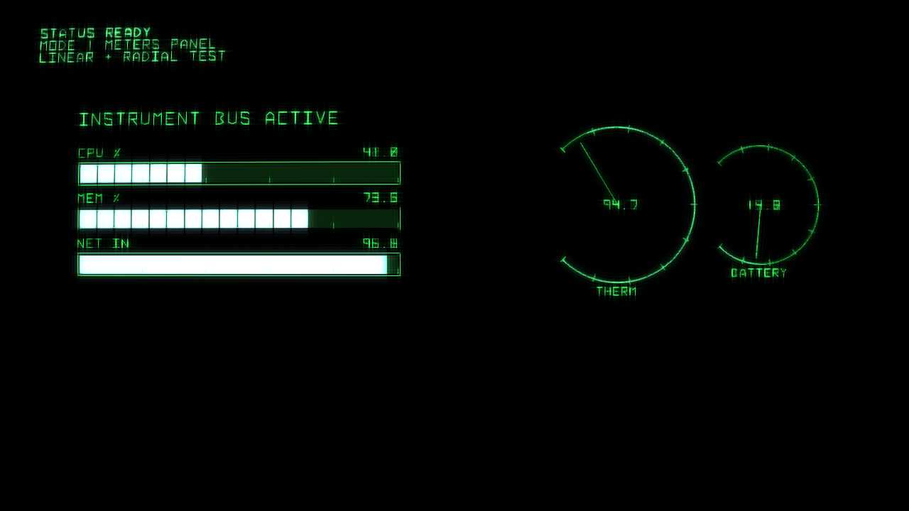
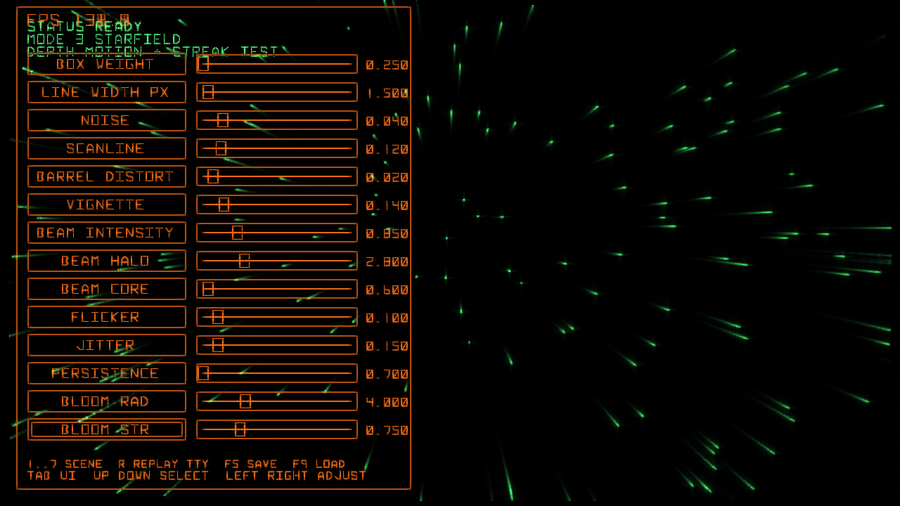
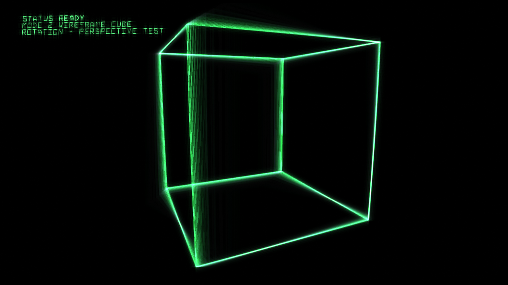
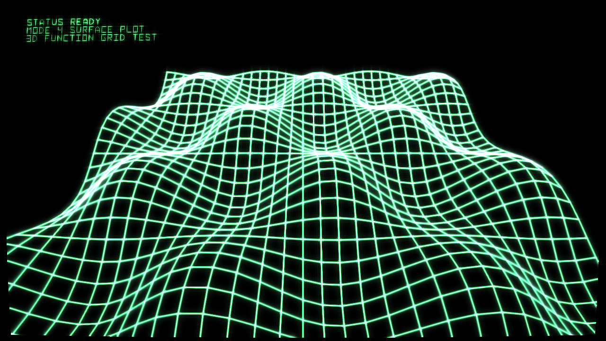

# Defcon Draw

Defcon Draw is a C vector graphics library for Linux with a Vulkan backend and a CRT-inspired rendering style for retro games, tools, and UI.

## Screenshot Gallery

### Meters / Dashboard


### Debug UI


### Wireframe Cube


### Surface Plot


## Features

- Public C API in `include/vg.h`
- Built-in image stylization API in `include/vg_image.h` (mono scanline rendering)
- Text layout API in `include/vg_text_layout.h` (build + draw wrapped/aligned text layouts)
- Text effects helpers in `include/vg_text_fx.h` (typewriter reveal + optional beep callbacks + marquee-in-box)
- Vulkan backend with alpha/additive batching
- CPU fallback raster path (`vg_debug_rasterize_rgba8`)
- Retro CRT profile system with tunable bloom, persistence, jitter, flicker, scanlines, vignette, and barrel distortion
- Stroke text + boxed text + wrapped text helpers
- Stroke and fill primitives (`polyline`, `path`, `rect`, `convex fill`, `circle fill`)
- Reusable immediate-style debug UI (`vg_ui`)
- Extended widgets (`vg_ui_ext`): meters, line graphs, bar graphs, histogram, pie/donut charts, history buffers
- Multi-scene Vulkan demo with teletype effect, profile save/load, and live parameter tuning
- Image FX demo scene (`8`) using `nick.jpg` with scanline/thickness controls

## Documents

- API reference: `docs/api.md`
- Architecture notes: `docs/architecture.md`
- Image support plan: `docs/image_support_plan.md`
- Brainstorm / roadmap notes: `brainstorm.md`

## Build Instructions

```sh
cmake -S . -B build
cmake --build build -j
```

Run demos:

```sh
./build/vg_demo
./build/vg_demo_sdl
./build/vg_demo_vk_sdl
```

Vulkan demo controls:

- `TAB`: show/hide debug UI
- `1..8`: switch scene
- `UP/DOWN`: select UI row
- `LEFT/RIGHT`: adjust selected value (key-hold repeat supported)
- `R`: replay teletype message
- `F5`: save profile
- `F9`: load profile

Scene `8` uses a dedicated image debug panel (shown with `TAB`) for image parameter adjustment.
