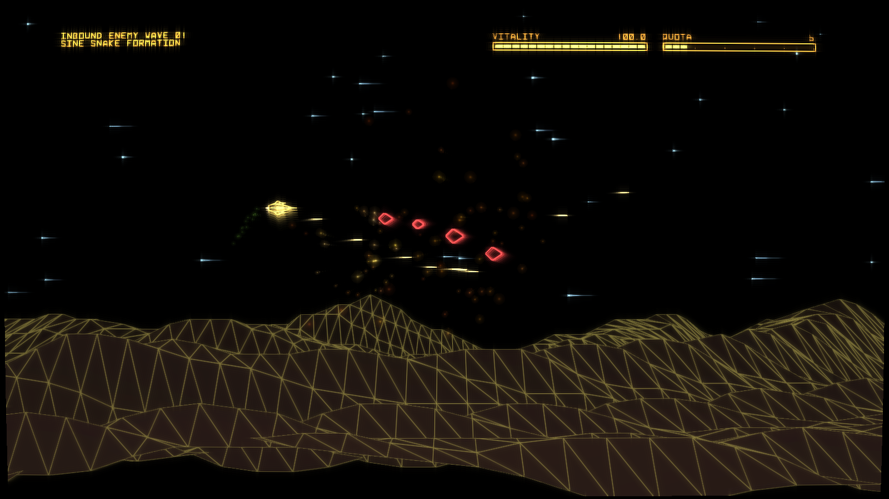

# VectorSwarm

VectorSwarm is an in-development side-scrolling vector space shooter written in C with DefconDraw, inspired by Defender, R-Type, and Darius.

## Screenshots




## Features

- Vivid monochromatic graphics with different phospher choices!
- Multiple level styles, including `Defender`, `Enemy Radar`, `Event Horizon` and who could forget `High Plains Drifter`
- Momentum-based 2D ship control (horizontal + vertical thrust with inertia) and elastic camera tracking
- Your very own shipyard to tune your craft to perfection
- Procedural enemy waves with formation, swarm, and kamikaze behaviors
- Teletype wave announcements, in-game synth-driven weapon/thruster sound design, and acoustics tuning UI

## Install

Coming Soon

## Build

```bash
cmake -S . -B build -DCMAKE_BUILD_TYPE=Release
cmake --build build -j
```

Run:

```bash
./build/VectorSwarm
```

This game is still in development. You can use the arrow keys and spacebar to control the ship. `n` will load the next level. the number keys 1-3 will access various settings screens. Expect new releases often.

## AMA with Commander Nick
### What are the green squiggly lines at the bottom of the screen?
Space hills. Anymore dumb questions...
