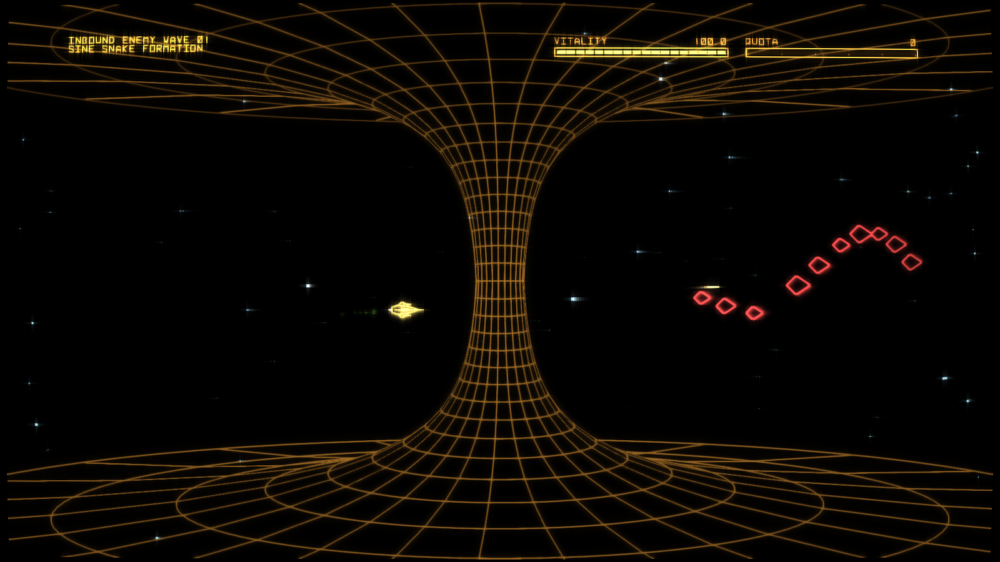
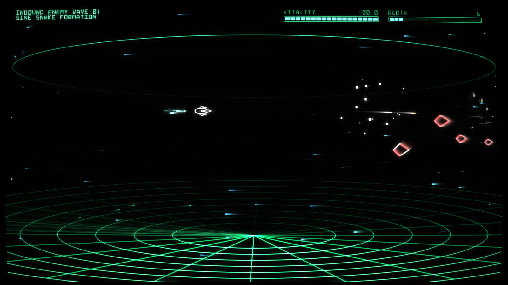

# VectorSwarm

VectorSwarm is an in-development side-scrolling vector space shooter written in C with DefconDraw, inspired by Defender, R-Type, and Darius.

## Screenshots

## Features

- Native Vulkan + DefconDraw vector rendering with CRT profile/post-processing pipeline
- Multiple level styles, including `Defender`, `Enemy Radar`, and two `Event Horizon` render paths
- Momentum-based 2D ship control (horizontal + vertical thrust with inertia) and elastic camera tracking
- Modular ship/weapons setup with upgradeable multi-shot fire patterns
- Procedural enemy waves with formation, swarm, and kamikaze behaviors
- Teletype wave announcements, in-game synth-driven weapon/thruster sound design, and acoustics tuning UI
